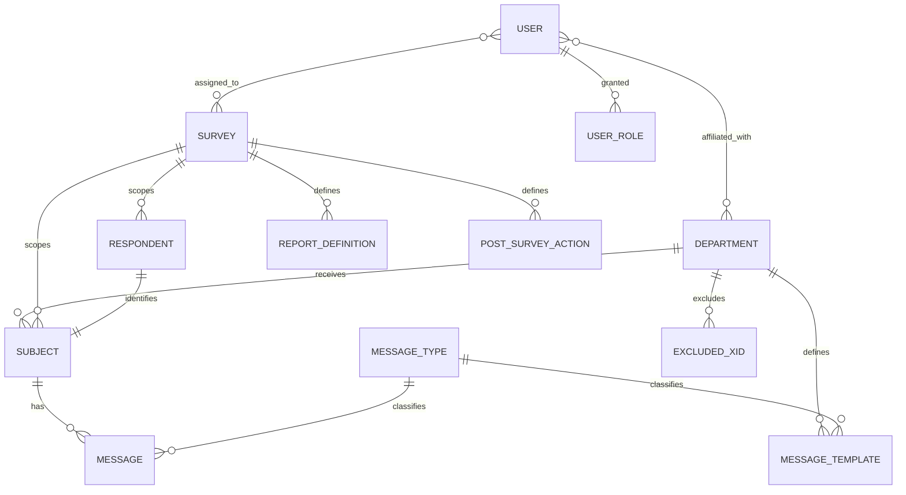

# Entity Model — Elicit Admin

This model is recovered from the Flyway migrations under
`src/main/resources/db/migration` and the JPA/Panache entities under
`com.elicitsoftware.model`. All tables live in the shared `survey` schema.

Elicit Admin is one module of a multi-module platform. Some entities are
**owned** by the Admin module (created by its migrations: departments, subjects,
messages, message types, message templates, users, user roles, and the
user/department and user/survey associations). Others — **SURVEY**,
**RESPONDENT**, **REPORT_DEFINITION**, **POST_SURVEY_ACTION**, and
**EXCLUDED_XID** — are owned by sibling modules (Authoring / Survey) but are
mapped here as JPA entities because Admin reads and, in some flows, writes them.
Owned-elsewhere entities are noted in their descriptions.

`STATUS` is a database **view**, not a table — a read model that joins
respondent, subject, and department to expose each subject's progress. It is
listed after the entities for completeness but is not part of the ER diagram.

## Entity Relationship Diagram

## Entities

### DEPARTMENT

An organizational unit that owns subjects, defines outbound-email identity, and selects which message templates are sent on registration.

| Attribute            | Description                                                          | Data Type | Length/Precision | Validation Rules              |
|----------------------|----------------------------------------------------------------------|-----------|------------------|-------------------------------|
| id                   | Unique identifier                                                    | Long      |                  | Primary Key, Sequence         |
| name                 | Department name                                                      | String    | 255              | Not Null, Unique              |
| code                 | Short department code                                                | String    | 100              | Optional, Unique              |
| defaultMessageId     | Comma-separated template IDs to send when a subject is registered    | String    | 100              | Not Null                      |
| notificationEmails   | Addresses notified when a respondent finishes                        | String    | 2000             | Optional                      |
| fromEmail            | Sender address for the department's outbound email                   | String    | 50               | Not Null, Format: Email       |

### SUBJECT

A person registered to take a survey, associated with a department and linked to a single respondent record.

| Attribute     | Description                                     | Data Type | Length/Precision | Validation Rules                          |
|---------------|-------------------------------------------------|-----------|------------------|-------------------------------------------|
| id            | Unique identifier                               | Long      |                  | Primary Key, Sequence                     |
| xid           | External identifier from the source system      | String    | 50               | Optional; Unique per Department            |
| firstName     | First name                                      | String    | 50               | Not Null                                  |
| lastName      | Last name                                       | String    | 50               | Not Null                                  |
| middleName    | Middle name                                     | String    | 50               | Optional                                  |
| dob           | Date of birth                                   | Date      |                  | Optional, Past                            |
| email         | Email address                                   | String    | 255              | Not Null, Format: Email                   |
| phone         | Phone number                                    | String    | 20               | Optional, Format: ###-###-####            |
| departmentId  | Owning department                               | Long      |                  | Not Null, Foreign Key (departments.id)    |
| surveyId      | Survey the subject is registered for            | Long      |                  | Not Null, Foreign Key (surveys.id)        |
| respondentId  | Linked respondent record                        | Long      |                  | Not Null, Foreign Key (respondents.id)    |
| createdDt     | Creation timestamp                              | DateTime  |                  | Not Null                                  |

### RESPONDENT

*Owned by the Survey module.* The record that carries a subject's survey access token and tracks access/finalization timestamps used to derive progress.

| Attribute     | Description                                | Data Type | Length/Precision | Validation Rules                    |
|---------------|--------------------------------------------|-----------|------------------|-------------------------------------|
| id            | Unique identifier                          | Long      |                  | Primary Key, Sequence               |
| surveyId      | Survey this respondent belongs to          | Long      |                  | Not Null, Foreign Key (surveys.id)  |
| token         | Survey access token                        | String    |                  | Not Null; Unique per Survey         |
| active        | Whether the respondent is active           | Boolean   |                  | Not Null                            |
| createdDt     | Creation timestamp                         | DateTime  |                  | Optional                            |
| firstAccessDt | When the survey was first accessed         | DateTime  |                  | Optional                            |
| finalizedDt   | When the survey was finalized              | DateTime  |                  | Optional                            |

### SURVEY

*Owned by the Authoring module.* A survey definition subjects are registered against; parent of its report definitions and post-survey actions.

| Attribute         | Description                                    | Data Type | Length/Precision | Validation Rules      |
|-------------------|------------------------------------------------|-----------|------------------|-----------------------|
| id                | Unique identifier                              | Long      |                  | Primary Key, Sequence |
| displayOrder      | Ordering position among surveys                | Integer   | 3                | Not Null              |
| name              | Internal survey name                           | String    |                  | Optional              |
| title             | Display title                                  | String    |                  | Optional              |
| description       | Description                                    | String    |                  | Optional              |
| initialDisplayKey | Key of the first item to display               | String    |                  | Optional              |
| postSurveyURL     | URL to redirect to after completion            | String    |                  | Optional              |

### MESSAGE

An email/message queued for a subject; recorded when created and stamped when sent.

| Attribute   | Description                          | Data Type | Length/Precision | Validation Rules                          |
|-------------|--------------------------------------|-----------|------------------|-------------------------------------------|
| id          | Unique identifier                    | Long      |                  | Primary Key, Sequence                     |
| subjectId   | Subject the message is for           | Long      |                  | Not Null, Foreign Key (subjects.id)       |
| messageType | Type of message                      | Long      |                  | Not Null, Foreign Key (message_types.id)  |
| mimeType    | Content type                         | String    | 100              | Not Null, Values: text/html, text/plain   |
| subjectLine | Email subject line                   | String    | 255              | Not Null                                  |
| body        | Message body                         | String    | 6000             | Not Null                                  |
| createdDt   | Creation timestamp                   | DateTime  |                  | Not Null                                  |
| sentDt      | When the message was sent            | DateTime  |                  | Optional                                  |

### MESSAGE_TYPE

A classification for messages and templates (for example, invitation or reminder).

| Attribute | Description        | Data Type | Length/Precision | Validation Rules      |
|-----------|--------------------|-----------|------------------|-----------------------|
| id        | Unique identifier  | Long      |                  | Primary Key, Sequence |
| name      | Type name          | String    | 25               | Not Null, Unique      |

### MESSAGE_TEMPLATE

A reusable subject line and body, scoped to a department and a message type, used to generate a subject's messages.

| Attribute     | Description                        | Data Type | Length/Precision | Validation Rules                          |
|---------------|------------------------------------|-----------|------------------|-------------------------------------------|
| id            | Unique identifier                  | Long      |                  | Primary Key, Sequence                     |
| departmentId  | Owning department                  | Long      |                  | Not Null, Foreign Key (departments.id)    |
| messageTypeId | Message type                       | Long      |                  | Not Null, Foreign Key (message_types.id)  |
| subject       | Template subject line              | String    | 255              | Not Null                                  |
| message       | Template body                      | String    | 6000             | Not Null                                  |
| mimeType      | Content type                       | String    | 100              | Not Null, Values: text/html, text/plain   |

### USER

An application user account, matched to an authenticated identity by username, and affiliated with departments and surveys.

| Attribute | Description                                  | Data Type | Length/Precision | Validation Rules      |
|-----------|----------------------------------------------|-----------|------------------|-----------------------|
| id        | Unique identifier                            | Long      |                  | Primary Key, Sequence |
| username  | Login identifier matched against the identity | String   | 100              | Not Null, Unique      |
| firstName | First name                                   | String    | 255              | Not Null              |
| lastName  | Last name                                    | String    | 255              | Not Null              |
| active    | Whether the account may operate on data      | Boolean   |                  | Not Null              |

### USER_ROLE

A role granted to a user, used as the database fallback when the identity provider supplies no application role.

| Attribute | Description                     | Data Type | Length/Precision | Validation Rules                    |
|-----------|---------------------------------|-----------|------------------|-------------------------------------|
| userId    | User the role is granted to     | Long      |                  | Not Null, Foreign Key (users.id)    |
| roleName  | Granted role name               | String    | 100              | Not Null                            |

*Primary key is the composite of userId and roleName.*

### EXCLUDED_XID

*Owned by the Survey module.* An external identifier that must not be registered as a subject within a given department.

| Attribute    | Description                              | Data Type | Length/Precision | Validation Rules                       |
|--------------|------------------------------------------|-----------|------------------|----------------------------------------|
| id           | Unique identifier                        | Long      |                  | Primary Key, Sequence                  |
| xid          | Excluded external identifier             | String    | 255              | Not Null; Unique per Department         |
| departmentId | Department the exclusion applies to      | Long      |                  | Not Null                               |
| reason       | Why the identifier is excluded           | String    | 500              | Optional                               |
| createdDt    | When the exclusion was recorded          | DateTime  |                  | Not Null                               |
| createdBy    | Who recorded the exclusion               | String    | 100              | Optional                               |

### REPORT_DEFINITION

*Owned by the Authoring module.* A named report available for a survey, resolved to an external report service URL when generating a subject's PDF.

| Attribute    | Description                    | Data Type | Length/Precision | Validation Rules                   |
|--------------|--------------------------------|-----------|------------------|------------------------------------|
| id           | Unique identifier              | Long      |                  | Primary Key, Sequence              |
| surveyId     | Survey the report belongs to   | Long      |                  | Not Null, Foreign Key (surveys.id) |
| name         | Report name                    | String    |                  | Optional                           |
| description  | Report description             | String    |                  | Optional                           |
| url          | Report service endpoint        | String    |                  | Optional                           |
| displayOrder | Ordering position              | Integer   |                  | Optional                           |

### POST_SURVEY_ACTION

*Owned by the Authoring module.* An action to run after a survey is completed, ordered within its survey.

| Attribute      | Description                   | Data Type | Length/Precision | Validation Rules                   |
|----------------|-------------------------------|-----------|------------------|------------------------------------|
| id             | Unique identifier             | Long      |                  | Primary Key, Sequence              |
| surveyId       | Survey the action belongs to  | Long      |                  | Not Null, Foreign Key (surveys.id) |
| name           | Action name                   | String    |                  | Optional                           |
| description    | Action description            | String    |                  | Optional                           |
| url            | Action endpoint               | String    |                  | Optional                           |
| executionOrder | Order of execution            | Integer   |                  | Optional                           |

## Associations

### USER_DEPARTMENTS

Join table linking users to the departments they are affiliated with. Composite key of `user_id` (FK → users.id) and `department_id` (FK → departments.id).

### USER_SURVEYS

Join table linking users to the surveys they are assigned to. Composite key of `user_id` (FK → users.id) and `survey_id` (FK → surveys.id). Present in the data model but not edited through the current admin screens.

## Derived Read Model

### STATUS (view)

A database view joining `respondents`, `subjects`, and `departments` to expose each subject's demographics, token, department, and a derived progress status (`Not Started`, `In Progress`, `Finished`) based on the respondent's first-access and finalized timestamps. Backs the search/monitoring view (UC-002); read-only.
